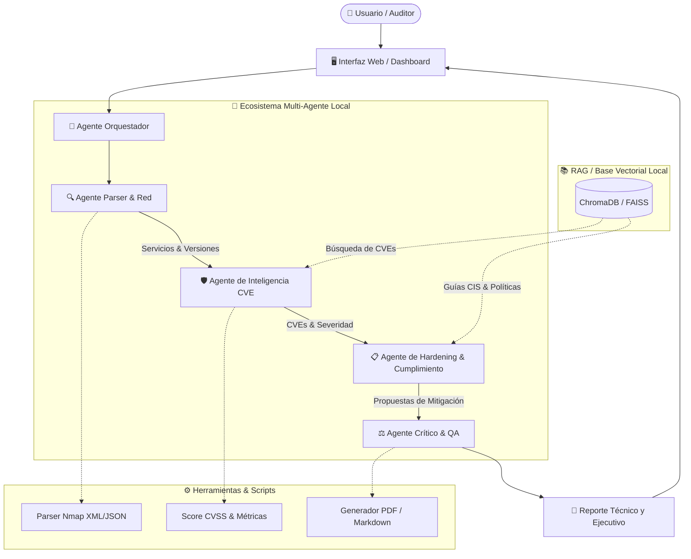

# 🦫 AI-CAPIBARA-HACKER
### Sistema Multi-Agente de Auditoría de Seguridad, Análisis de Vulnerabilidades y Remediación

Proyecto desarrollado para la materia **Intelligent Engineering**. Este sistema implementa un ecosistema multiagente local para automatizar el análisis técnico de escaneos de red (ej. Nmap), correlacionar vulnerabilidades conocidas (CVEs), contrastar configuraciones con guías de *hardening* (CIS Benchmarks) y generar recomendaciones de mitigación accionables.

---

## 🎯 Objetivo del Proyecto

Demostrar la aplicación práctica e integrada de los principales paradigmas y técnicas de la **Inteligencia Artificial Generativa y Sistemas de Agentes Autónomos**, ejecutados **100% de manera local** sin dependencia de APIs comerciales externas.

---

## 🧠 Conceptos de IA Implementados

| Concepto de IA | Implementación en el Proyecto |
| :--- | :--- |
| **Arquitectura Multi-Agente (MAS)** | Orquestación mediante grafos colaborativos donde agentes con roles especializados (Parser, Inteligencia CVE, Cumplimiento y Crítico) colaboran para auditar un sistema. |
| **RAG (Retrieval-Augmented Generation)** | Búsqueda semántica e híbrida sobre bases vectoriales locales alimentadas con bases de datos de vulnerabilidades (NVD/CVE), guías CIS Benchmarks y políticas corporativas. |
| **Tool Calling & Script Execution** | Capacidad del agente para invocar funciones y scripts en Python (lectores de XML/JSON de Nmap, calculadoras CVSS, generadores de reportes). |
| **Ingeniería de Prompts & Personas** | Definición estricta de roles, restricciones éticas, delimitación de alcance (*guardrails*) y salidas en formatos estructurados (JSON/Markdown). |
| **Manejo de Contexto & Sliding Window** | Técnicas de resumen, podado de contexto y memoria de conversación para maximizar la eficiencia de la ventana de contexto del LLM local. |
| **Human-in-the-Loop & Agente Crítico** | Validación cruzada para reducción de alucinaciones, descarte de falsos positivos y verificación de coherencia técnica antes del reporte final. |

---

## 🏛️ Arquitectura del Sistema



---

## 👥 Roles de los Agentes

1. **🧭 Agente Orquestador / Planificador:**
   - Define el flujo de trabajo según los datos de entrada.
   - Aplica validaciones de alcance y restricciones éticas.
   - Coordina el paso de mensajes y estado entre agentes.

2. **🔍 Agente de Análisis de Red & Parser:**
   - Ingesta y procesa la salida de escaneos (XML/JSON de Nmap).
   - Extrae puertos abiertos, servicios expuestos y versiones exactas (CPEs).
   - Estructura un inventario limpio de activos para auditoría.

3. **🛡️ Agente de Inteligencia de Vulnerabilidades (RAG CVE):**
   - Cruza las versiones detectadas contra la base vectorial técnica.
   - Identifica CVEs relevantes, vectores de ataque (CVSS v3) y debilidades comunes (CWE).

4. **📋 Agente de Cumplimiento & Remediación:**
   - Consulta guías de endurecimiento (*hardening*) y estándares de seguridad.
   - Redacta recomendaciones concretas (parches, reglas de firewall, ajustes de configuración en `/etc/`).

5. **⚖️ Agente Crítico / Validador (QA):**
   - Revisa que las recomendaciones no generen falsos positivos evidentes ni afecten la disponibilidad del servicio.
   - Consolida y da formato al informe técnico final.

---

## 🛠️ Stack Tecnológico

- **Motor LLM Local:** [Ollama](https://ollama.com/) ejecutando `qwen2.5:14b`
- **Embeddings Locales:** `nomic-embed-text` / `bge-small-en-v1.5`
- **Base Vectorial (RAG):** ChromaDB / FAISS
- **Framework Multiagente:** LangGraph / CrewAI / LangChain
- **Interfaz de Usuario:** Streamlit / Gradio
- **Lenguaje:** Python 3.10+

---

## 🚀 Requisitos Previos

1. **Ollama instalado y en ejecución:**
   ```bash
   ollama run qwen2.5:14b
   ollama pull nomic-embed-text
   ```
2. **Entorno Python configurado:**
   ```bash
   python -m venv venv
   # En Windows:
   .\venv\Scripts\activate
   # En Linux/Mac:
   source venv/bin/activate
   ```

---


⠀⠀⠀⠀⠀⠀⠀⠀⠀⠀⠀⠀⠀⠀⠀⠀⠀⠀⠀⠀⠀⠀⠀⠀⠀⠀⠀⠀⠀⠀⠀⠀⠀⠀⠀⠀⠀⠀⠀⠀⠀⠀⠀⣀⣀⣀⠀⠀⠀⠀⠀⠀⠀⠀⠀⠀⠀⠀⠀⠀⠀⠀⠀⠀⠀⠀⠀⠀⠀⠀⠀
⠀⠀⠀⠀⠀⠀⠀⠀⠀⠀⠀⠀⠀⠀⠀⠀⠀⠀⠀⠀⠀⠀⠀⠀⠀⠀⠀⠀⠀⠀⠀⠀⠀⠀⠀⠀⠀⣀⣀⣀⣀⣴⣿⣿⣿⣾⣤⠀⠀⠀⠀⠀⠀⠀⠀⠀⠀⠀⠀⠀⠀⠀⠀⠀⠀⠀⠀⠀⠀⠀⠀
⠀⠀⠀⠀⠀⠀⠀⠀⠀⠀⠀⠀⠀⠀⠀⠀⠀⠀⠀⠀⢀⣠⣀⡄⣴⣤⠦⣶⢴⣪⡷⠶⡶⢛⣿⢛⡝⣩⢿⠗⣋⡽⢋⣿⣿⣿⣟⣧⣄⠀⠀⠀⠀⠀⠀⠀⠀⠀⠀⠀⠀⠀⠀⠀⠀⠀⠀⠀⠀⠀⠀
⠀⠀⠀⠀⠀⠀⠀⠀⠀⠀⠀⠀⠀⠀⠀⠀⠀⠀⢀⢶⢟⡯⢛⢚⢋⡶⡹⣑⣪⠞⣢⠪⡲⠋⢔⠑⣈⠥⠂⠀⢅⣰⣷⣯⡿⢿⣿⣿⡋⡧⣀⠀⠀⠀⠀⠀⠀⠀⠀⠀⠀⠀⠀⠀⠀⠀⠀⠀⠀⠀⠀
⠀⠀⠀⠀⠀⠀⠀⠀⠀⠀⠀⠀⠀⣀⣀⣤⣖⢞⠍⢔⠏⠀⢋⢁⠵⣢⢞⡮⠗⣊⣢⣚⠈⠀⠀⠀⠒⠀⠄⣁⠢⠀⢿⣿⣿⣷⣝⢿⣿⣏⣾⣧⣄⠀⠀⠀⠀⠀⠀⠀⠀⠀⠀⠀⠀⠀⠀⠀⠀⠀⠀
⠀⠀⠀⠀⠀⠀⠀⠀⠀⣀⣴⠖⢛⡩⠛⢁⡔⠅⠞⠫⠀⡔⣡⠾⣛⣽⣿⠺⠛⠛⠽⣵⣤⣜⠠⠁⠄⠀⠀⠂⢀⣁⠈⣿⣿⣿⢿⡞⣿⣿⢸⢯⣟⣆⠀⠀⠀⠀⠀⠀⠀⠀⠀⠀⠀⠀⠀⠀⠀⠀⠀
⠀⠀⠀⠀⠀⠀⣠⣴⠾⠟⢣⢞⠏⡠⠔⡤⠀⠀⣀⠤⣟⡬⣾⣪⣟⣫⣤⣥⣄⣉⣭⣖⣢⡦⠐⠁⡈⠁⠀⠀⠀⡀⠐⣿⣿⣯⣾⣽⣿⣷⣿⣳⡟⣾⣷⠄⠀⠀⠀⠀⠀⠀⠀⠀⠀⠀⠀⠀⠀⠀⠀
⠀⠀⠀⢀⣴⡿⣟⠋⠌⠔⢑⠄⢂⠀⠋⡠⠚⠉⠀⠉⠀⡜⢻⠷⣿⣿⣿⣿⣿⣿⠟⣡⠾⠂⢍⠀⠄⠀⢠⠄⣠⠥⣀⢼⣿⣿⣿⣿⠿⡛⢷⢾⣿⣮⡿⣓⠄⠀⠀⠀⠀⠀⠀⠀⠀⠀⠀⠀⠀⠀⠀
⠀⢀⣴⣿⣷⢺⣁⢈⠅⠨⠀⠤⠨⠐⠒⠀⠀⠈⠀⢤⠀⠁⠦⣳⢦⣉⣉⣉⣩⣰⠿⠓⠊⠀⡐⣠⠉⠀⠐⠠⠔⠨⣁⠪⡡⠠⣐⠬⣲⣫⣜⡓⣯⣻⣯⣻⣷⡀⠀⠀⠀⠀⠀⠀⠀⠀⠀⠀⠀⠀⠀
⠀⡾⣿⣾⣿⣶⢕⡢⠊⠐⠀⡈⢀⠐⢀⣁⡨⠉⠄⠀⠉⢑⠒⡤⠠⠍⡛⣡⠈⠤⡁⢁⠒⠡⣩⠅⣓⡴⢂⠗⣸⢫⣔⢖⠢⡀⠪⣙⠳⣎⢗⣯⣾⣷⢧⣫⣻⣝⠂⠀⠀⠀⠀⠀⠀⠀⠀⠀⠀⠀⠀
⢸⡗⢿⡽⣿⡫⣉⠀⡼⠡⢁⡀⠄⣀⣀⠠⠉⠀⠂⡉⠟⠶⢤⣀⠉⡈⡑⠢⠀⠲⢐⠠⢘⠁⢂⠬⣡⣊⢔⡤⣑⠪⣘⢕⠤⣑⡠⢄⡑⣌⠲⢷⡪⡼⣖⣯⢷⣽⡦⠀⠀⠀⠀⠀⠀⠀⠀⠀⠀⠀⠀
⢸⣿⣬⣧⡟⠥⠔⣀⢘⠦⠑⡪⢄⡠⡦⣉⡘⠑⡶⣨⢜⡘⢂⠵⡥⡀⠵⢦⡔⣫⣔⡱⣅⠛⣵⠭⣒⢭⡋⣸⡵⢗⣝⢳⣜⠢⡫⡢⡑⢌⢝⢦⣽⠾⡶⡝⢷⣍⢿⡇⠄⠀⠀⠀⠀⠀⠀⠀⠀⠀⠀
⠘⣿⣿⣿⣿⣦⠁⠆⢬⣆⠪⡍⣶⣷⢷⣿⣿⣿⣿⣾⣿⣾⣑⣮⣞⣝⡮⢥⢏⠶⣵⡩⣜⠫⢗⡥⣃⢍⠚⢔⡽⣼⡸⣙⢸⡢⡈⠪⡪⣎⢷⣍⣻⣳⣽⢾⢮⣿⣿⡿⡀⠀⠀⠀⠀⠀⠀⠀⠀⠀⠀
⠀⢻⣿⣿⣿⣕⢦⡈⣕⣝⣦⡛⢿⣫⢾⣍⡻⢙⠢⢅⡻⢝⣷⣗⢪⢝⢯⢷⢷⡩⣲⣽⡮⣿⣿⣝⡪⢑⢵⢤⡹⢌⡫⣪⡑⢕⢌⠣⣘⢮⣳⣝⢮⢷⡽⣯⣷⣿⡟⣡⣷⡀⠀⠀⠀⠀⠀⠀⠀⠀⠀
⠀⡼⣿⣿⣿⣆⣂⠙⣯⡾⡮⣻⠽⣌⠲⡌⠡⢗⠸⣆⠠⠹⢌⠲⡙⢳⣄⠝⣜⠳⣴⡼⣍⡣⣳⡭⠪⡶⢕⢵⢮⠳⣵⢭⡾⢕⣕⣷⠙⣦⡻⣝⣫⣳⣿⣿⡿⢋⣴⣿⣿⣷⡀⠀⠀⠀⠀⠀⠀⠀⠀
⠀⠀⠸⣿⣯⣼⣿⣧⣿⣷⣮⡘⣷⣼⢳⡼⣧⢬⣑⢽⣷⣝⢶⣽⣜⡶⡬⣿⣢⡙⢎⢾⣬⢝⢮⣘⢆⢎⢮⡣⣣⣱⠺⣧⡹⣯⢮⢿⣷⡙⣷⣿⣿⣿⡿⠋⣠⣾⣿⣿⣿⣿⣷⠀⠀⠀⠀⠀⠀⠀⠀
⠀⠀⠌⠝⢿⣿⣿⣿⣿⣿⣿⣻⣮⣿⣽⣿⣿⣵⢿⣷⣮⣯⣳⣿⣻⣿⣻⣞⣿⣾⣻⢦⣯⣷⣥⣫⡖⡕⡝⢗⢽⣯⣷⣜⣷⣏⣿⣷⣽⣿⣿⡿⠟⠈⣠⣾⣿⣿⣿⣿⣿⣿⣿⣷⡀⠀⠀⠀⠀⠀⠀
⠀⠈⠀⠀⠈⠈⠻⠻⣿⣿⣿⣿⣿⣿⣿⣿⣿⣿⣿⣿⣿⣿⣿⣿⣿⣿⢿⣾⣿⣿⣷⣿⣿⢷⡿⣷⣞⣿⣼⣮⣷⣵⡽⣿⣷⣽⣷⣿⣿⡿⢫⠈⣠⣾⣿⣿⣿⣿⣿⣿⣿⣿⣿⣿⣿⣄⠀⠀⠀⠀⠀
⠀⠀⠀⠀⠀⠀⠀⠀⠈⠛⠛⠛⠛⠟⠻⠛⠿⢿⢿⣿⣿⣿⣿⣿⣿⣿⣿⣿⣿⣿⣿⣿⣿⣷⣿⣿⣻⡷⣳⣇⣿⣾⣝⣾⣽⣿⣿⡿⡻⠚⣡⣼⣿⣿⣿⣿⣿⣿⣿⣿⣿⣿⣿⣿⣿⣿⣦⡀⠀⠀⠀
⠀⠀⠀⠀⠀⠀⠀⠀⠀⠀⠀⠀⠀⠀⠀⠀⠀⠀⠀⠀⠀⠈⠏⠸⠉⠿⢿⣿⣿⣿⣿⣿⣿⣿⣿⣾⣿⣏⢿⣿⡾⣹⣾⣾⣿⡿⣉⠎⠀⣶⣿⣿⣿⣿⣿⣿⣿⣿⣿⣿⣿⣿⣿⣿⣿⣿⣿⣷⡀⠀⠀
⠀⠀⠀⠀⠀⠀⠀⠀⠀⠀⠀⠀⠀⠀⠀⠀⠀⠀⠀⠀⠀⠀⠀⠀⠀⠀⠀⠙⣿⣿⣿⣿⣿⣿⣿⣿⣿⡿⣜⣿⣼⣿⣿⣿⡿⠕⠁⣠⣾⣿⣿⣿⣿⣿⣿⣿⣿⣿⣿⣿⣿⣿⣿⣿⣿⣿⣿⣿⣿⣦⠀
⠀⠀⠀⠀⠀⠀⠀⠀⠀⠀⠀⠀⠀⠀⠀⠀⠀⠀⠀⠀⠀⠀⠀⠀⠀⠀⠀⠀⢹⣿⣿⣿⣿⣿⣿⣿⣿⣿⣧⣿⣿⡿⡫⠋⠀⣠⣾⣿⣿⣿⣿⣿⣿⣿⣿⣿⣿⣿⣿⣿⣿⣿⣿⣿⣿⣿⣿⣿⣿⣿⣷
⠀⠀⠀⠀⠀⠀⠀⠀⠀⠀⠀⠀⠀⠀⠀⠀⠀⠀⠀⠀⠀⠀⠀⠀⠀⠀⣠⠲⢚⠻⢿⣿⣿⣿⣿⣿⣿⣷⣿⣛⠗⠋⠀⣠⣾⣿⣿⣿⣿⣿⣿⣿⣿⣿⣿⣿⣿⣿⣿⣿⣿⣿⣿⣿⣿⣿⣿⣿⣿⣿⣿
⠀⠀⠀⠀⠀⠀⠀⠀⠀⠀⠀⠀⠀⠀⠀⠀⠀⠀⠀⠀⠀⠀⠀⣠⣴⡾⡊⠁⡀⣜⣣⣾⣾⣿⣿⣿⠯⠷⠋⠀⢀⣠⣾⣿⣿⣿⣿⣿⣿⣿⣿⣿⣿⣿⣿⣿⣿⣿⣿⣿⣿⣿⣿⣿⣿⣿⣿⣿⣿⣿⣿
⠀⠀⠀⠀⠀⠀⠀⠀⠀⠀⠀⠀⠀⠀⠀⠀⠀⠀⠀⠀⢀⣴⣿⢿⡏⠦⠁⣰⡱⢮⣷⣿⣿⠿⢋⠄⠈⠀⢀⣠⣿⣿⣿⣿⣿⣿⣿⣿⣿⣿⣿⣿⣿⣿⣿⣿⣿⣿⣿⣿⣿⣿⣿⣿⣿⣿⣿⣿⣿⣿⡇
⠀⠀⠀⠀⠀⠀⠀⠀⠀⠀⠀⠀⠀⠀⠀⠀⠀⠀⠀⣰⣿⠟⠁⣼⣏⠀⡰⢆⡟⣻⣿⣿⠡⠂⠀⠀⠀⣰⣿⣿⣿⣿⣿⣿⣿⣿⣿⣿⣿⣿⣿⣿⣿⣿⣿⣿⣿⣿⣿⣿⣿⣿⣿⣿⣿⣿⣿⣿⣿⣿⠇
⠀⠀⠀⠀⠀⠀⠀⠀⠀⠀⠀⠀⠀⠀⠀⠀⠀⠀⢀⣿⠃⠀⢠⣿⠂⢀⠹⣢⣿⣿⠟⠁⠀⠀⠀⣠⣾⣿⣿⣿⣿⣿⣿⣿⣿⣿⣿⣿⣿⣿⣿⣿⣿⣿⣿⣿⣿⣿⣿⣿⣿⣿⣿⣿⣿⣿⣿⣿⣿⡿⠀
⠀⠀⠀⠀⠀⠀⠀⠀⠀⠀⠀⠀⠀⠀⠀⠀⠀⢠⡿⢁⠤⢶⣞⣥⣤⣤⣇⣳⡟⣡⡀⠀⠀⢀⣾⣿⣿⣿⣿⣿⣿⣿⣿⣿⣿⣿⣿⣿⣿⣿⣿⣿⣿⣿⣿⣿⣿⣿⣿⣿⣿⣿⣿⣿⣿⣿⣿⠟⠋⠀⠀
⠀⠀⠀⠀⠀⠀⠀⠀⠀⠀⠀⠀⠀⠀⠀⠀⢠⡿⠁⠀⣠⣾⠋⠢⡝⣯⢻⣿⡟⠉⠈⢆⣴⣿⣿⣿⣿⣿⣿⣿⣿⣿⣿⣿⣿⣿⣿⣿⣿⣿⣿⣿⣿⣿⣿⣿⣿⣿⣿⣿⣿⣿⣿⣿⣿⢋⠁⠀⠀⠀⠀
⠀⠀⠀⠀⠀⠀⠀⠀⠀⠀⠀⠀⠀⠀⠀⣠⡿⠁⢀⡾⠻⠃⠰⡱⢪⣱⣿⡟⠀⠀⣰⣿⣿⣿⣿⣿⣿⣿⣿⣿⣿⣿⣿⣿⣿⣿⣿⣿⣿⣿⣿⣿⣿⣿⣿⣿⣿⣿⣿⣿⣿⣿⣿⡿⠛⠁⠀⠀⠀⠀⠀
⠀⠀⠀⠀⠀⠀⠀⠀⠀⠀⠀⠀⠀⠀⠀⣿⡇⠰⢫⠸⡁⡈⢶⡙⣵⣿⣿⠀⣠⣾⣿⣿⣿⣿⣿⣿⣿⣿⣿⣿⣿⣿⣿⣿⣿⣿⣿⣿⣿⣿⣿⣿⣿⣿⣿⣿⣿⣿⣿⣿⣿⠟⠉⠀⠀⠀⠀⠀⠀⠀⠀
⠀⠀⠀⠀⠀⠀⠀⠀⠀⠀⠀⠀⠀⠀⠀⣿⡇⠇⣳⠣⠈⠔⢣⣼⣿⣿⣧⣾⣿⣿⣿⣿⣿⣿⣿⣿⣿⣿⣿⣿⣿⣿⣿⣿⣿⣿⣿⣿⣿⣿⣿⣿⣿⣿⣿⣿⣿⣿⡿⠋⠁⠀⠀⠀⠀⠀⠀⠀⠀⠀⠀
⠀⠀⠀⠀⠀⠀⠀⠀⠀⠀⠀⠀⠀⠀⠀⣿⡇⢨⣇⠀⡁⢌⡿⣿⣿⣿⣿⣿⣿⣿⣿⣿⣿⣿⣿⣿⣿⣿⣿⣿⣿⣿⣿⣿⣿⣿⣿⣿⣿⣿⣿⣿⣿⣿⣿⠿⠛⠁⠀⠀⠀⠀⠀⠀⠀⠀⠀⠀⠀⠀⠀
⠀⠀⠀⠀⠀⠀⠀⠀⠀⠀⠀⠀⠀⠀⠀⢻⣧⢸⢧⠆⡰⢋⢾⣿⣿⣿⣿⣿⣿⣿⣿⣿⣿⣿⣿⣿⣿⠟⡛⣉⡍⡽⢭⣛⣿⣿⣿⣿⣿⣿⣿⠟⠛⠊⠁⠀⠀⠀⠀⠀⠀⠀⠀⠀⠀⠀⠀⠀⠀⠀⠀
⠀⠀⠀⠀⠀⠀⠀⠀⠀⠀⠀⠀⠀⠀⠀⢸⣿⢸⢯⡖⣁⢬⣾⣿⣿⣿⣿⣿⣿⣿⣿⣿⣿⣿⣿⣿⣯⡼⣱⣮⣾⢛⣷⣯⣿⣿⣿⣿⠿⠋⠀⠀⠀⠀⠀⠀⠀⣼⣀⣀⣄⣀⣀⣀⠀⠀⠀⠀⠀⠀⠀
⠀⠀⠀⠀⠀⠀⠀⠀⠀⠀⠀⠀⠀⠀⠀⠀⢿⡯⢷⣻⣴⣿⣿⣿⣿⣿⣿⣿⣿⣿⣿⣿⣿⣿⣿⣿⣿⣿⣿⣿⣿⣿⣿⣿⣽⠿⠋⠁⠀⠀⠀⠀⠀⠀⠀⠀⠀⠉⠍⠀⠉⠉⠉⠁⠀⠀⠀⠀⠀⠀⠀
⠀⠀⠀⠀⠀⠀⠀⠀⠀⠀⠀⠀⠀⠀⠀⠀⠈⢻⢏⣿⣿⣿⣿⣿⣿⣿⣿⣿⣿⣿⣿⣿⣿⣿⣿⣿⣿⣿⣿⣿⣿⡿⠟⠋⠁⠀⠀⠀⠀⠀⠀⠀⠀⠀⠀⠀⠀⠀⠀⠀⠀⠀⠀⠀⠀⠀⠀⠀⠀⠀⠀
⠀⠀⠀⠀⠀⠀⠀⠀⠀⠀⠀⠀⠀⠀⠀⠀⠀⠈⢿⣿⣿⣿⣿⣿⣿⣿⣿⣿⣿⠿⠟⠻⠿⠿⠟⠛⠉⠉⠀⠀⠀⠀⠀⠀⠀⠀⠀⠀⠀⠀⠀⠀⠀⠀⠀⠀⠀⠀⠀⠀⠀⠀⠀⠀⠀⠀⠀⠀⠀⠀⠀
⠀⠀⠀⠀⠀⠀⠀⠀⠀⠀⠀⠀⠀⠀⠀⠀⠀⠀⠀⠈⠁⠀⠀⠀⠀⠀⠀⠀⠀⠀⠀⠀⠀⠀⠀⠀⠀⠀⠀⠀⠀⠀⠀⠀⠀⠀⠀⠀⠀⠀⠀⠀⠀⠀⠀⠀⠀⠀⠀⠀⠀⠀⠀⠀⠀⠀⠀⠀⠀⠀⠀

## 📄 Licencia y Uso Ético

Este proyecto tiene fines estrictamente **académicos, educativos y de auditoría defensiva**. Todas las operaciones de análisis y remediación están diseñadas para evaluar y mejorar la postura de seguridad de sistemas bajo autorización previa.
