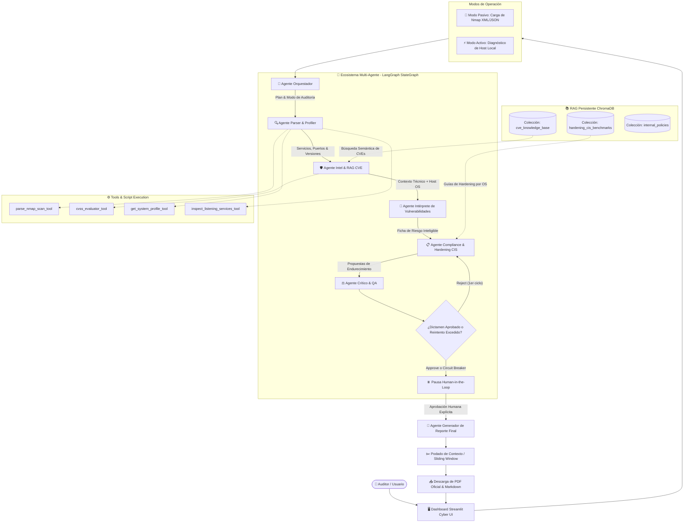

# 🦫 AI-CAPIBARA-HACKER
### Sistema Multi-Agente de Auditoría de Seguridad, Análisis de Vulnerabilidades y Remediación

Proyecto desarrollado para la materia **AI AGENTIC ENGINEERING**. Este sistema implementa un ecosistema multiagente autónomo local capaz de operar en **Modo Pasivo** (ingesta y análisis de escaneos de red Nmap XML/JSON) y **Modo Activo** (diagnóstico local del host mediante *Tool Calling* seguro de sockets TCP y perfil de OS), correlacionar vulnerabilidades técnicas (CVEs), contextualizar riesgos con un agente intérprete, contrastar configuraciones contra guías de endurecimiento (*CIS Benchmarks*) y emitir informes ejecutivos descargables en Markdown y PDF oficial.

---

## 🎯 Objetivo del Proyecto

Demostrar la integración práctica de los principales paradigmas de la **Ingeniería de Agentes de IA (Agentic AI)** y **LLMs Locales**:
- Ejecución **100% local y privada** con Ollama (`qwen2.5:14b` y embeddings `nomic-embed-text`), sin dependencia de APIs en la nube.
- Orquestación mediante grafos de estado (**LangGraph StateGraph**) con soporte para reintentos condicionales, disyuntores (*circuit breakers*) y puntos de interrupción con revisión humana (**Human-in-the-Loop**).
- Arquitectura **RAG Híbrida Multicolección** en ChromaDB con filtrado por servicio, versión y sistema operativo.

---

## 🧠 Conceptos y Prácticas de IA Implementados

| Concepto de IA | Implementación en AI-CAPIBARA-HACKER |
| :--- | :--- |
| **Arquitectura Multi-Agente (MAS)** | Grafo colaborativo en LangGraph donde 6 agentes especializados colaboran mutando un estado compartido estructurado (`AgentState`). |
| **Modo Activo & Tool Calling** | Herramientas con decoradores `@tool` de LangChain para inspección del sistema local (`psutil`), detección de sockets `LISTEN` y recolección segura de perfil de host. |
| **RAG (Retrieval-Augmented Generation)** | Búsqueda semántica e híbrida sobre **ChromaDB** persistente dividida en 3 colecciones: CVEs (NVD), CIS Hardening Benchmarks y Políticas Internas corporativas. |
| **Agente Intérprete y Explicador** | Agente que analiza el CVE recuperado por RAG y el entorno del host (ej. `Windows 11 AMD64`) para explicar en lenguaje claro qué es la vulnerabilidad, cómo interactúa con el OS y cuál es su riesgo real. |
| **Human-in-the-Loop (HITL)** | Punto de interrupción nativo (`MemorySaver` checkpointer) antes del reporte final: el auditor humano revisa el dictamen del Agente Crítico (`APPROVE`/`REJECT`) antes de autorizar la emisión del informe. |
| **Few-Shot Prompting & Personas** | Prompts con delimitación estricta de rol (*System Prompts*) y pares de ejemplos estructurados de entrada/salida para Orquestador, Parser, Intel, Compliance y Crítico. |
| **Circuit Breakers & Anti-Looping** | Contador de ciclos (`critic_retry_count`) en el router condicional para garantizar convergencia y evitar bucles infinitos entre Crítico y Cumplimiento. |
| **Sliding Window & Context Pruning** | Nodo de poda de contexto que recorta el historial de mensajes de LangGraph para proteger la ventana de contexto del LLM local de 14B. |

---

## 🏛️ Arquitectura del Sistema



---

## 👥 Roles y Responsabilidades de los Agentes

1. **🧭 Agente Orquestador (`src/agents/orchestrator.py`):**
   - Valida el modo de auditoría seleccionado (Pasivo vs. Activo).
   - Verifica permisos y autorizaciones explícitas de escaneo local.
   - Inicializa el plan de auditoría y coordina el paso de estado en el grafo.

2. **🔍 Agente de Análisis de Red y Host (`src/agents/parser.py`):**
   - **Modo Pasivo:** Ingesta y parsea archivos XML/JSON de escaneos Nmap, extrayendo puertos, servicios, versiones y CPEs.
   - **Modo Activo:** Ejecuta herramientas de inspección local (`inspect_listening_services`) para enumerar puertos en estado `LISTEN` de forma segura y solo lectura, identificando servicios nativos y aplicaciones de usuario.

3. **🛡️ Agente de Inteligencia de Vulnerabilidades (`src/agents/intel.py`):**
   - Consulta la base de conocimiento vectorial de CVEs mediante búsqueda híbrida por servicio y versión.
   - Deduplica firmas de servicio para optimizar las consultas a ChromaDB.
   - Calcula y normaliza severidades CVSS v3.1 (CRITICAL, HIGH, MEDIUM, LOW).

4. **🧠 Agente Intérprete y Explicador (`src/agents/interpreter.py`):**
   - Traduce los datos técnicos crudos del CVE y los contextualiza con el Sistema Operativo del usuario (`Windows 11`, Linux, etc.).
   - Estructura el análisis en 3 dimensiones claras:
     1. *¿Qué es esta vulnerabilidad?* (Explicación conceptual sin jerga excesiva).
     2. *Comportamiento en tu Sistema Operativo:* (Cómo afecta al socket, versión y puerto).
     3. *¿Por qué es un riesgo?:* (Consecuencias reales de confidencialidad, integridad y disponibilidad).

5. **📋 Agente de Cumplimiento y Remediación (`src/agents/compliance.py`):**
   - Consulta guías de endurecimiento en ChromaDB basadas en estándares **CIS Benchmarks** y políticas internas.
   - Genera planes de mitigación accionables con pasos de configuración y comandos reproducibles (ej. PowerShell, Bash, firewall).

6. **⚖️ Agente Crítico & QA (`src/agents/critic.py`):**
   - Evalúa la coherencia técnica entre las vulnerabilidades reportadas y las medidas de remediación.
   - Emite un veredicto estructurado (`approve` o `reject`) con justificación.
   - Respaldado por el *Circuit Breaker* en `router_critic` para asegurar que el flujo siempre concluya tras un ciclo de ajuste.

7. **📄 Agente de Reporte y Exportación (`src/utils/report_formatter.py` / `pdf_exporter.py`):**
   - Compila la matriz de inventario, vulnerabilidades interpretadas y plan de hardening.
   - Genera el informe Markdown en pantalla y compila un **documento PDF formal descargable** mediante ReportLab.

---

## 💻 Interfaz de Usuario (Streamlit Cyber Dashboard)

- **Consola Multi-Agente en Tiempo Real:** Terminal unificada con estilo oscuro que muestra los eventos con checkmark verde `✓` y resalta dinámicamente el agente activo en cian/neón brillante `▶️ [EN CURSO]`.
- **Barra de Progreso Sutil con Capibara Animado:** Indicador visual CSS que muestra un capibara (`🦫`) desplazándose sobre la barra de carga mientras los agentes procesan la información.
- **Selector de Modo de Auditoría:**
  - *Modo Pasivo:* Carga manual de archivo XML de Nmap o generación de escaneo sintético.
  - *Modo Activo:* Detección automática del Hostname, OS, arquitectura e IPs, con checkbox de autorización de seguridad para habilitar la inspección local.
- **Punto de Control Human-in-the-Loop:** Panel interactivo que expone el dictamen del Agente Crítico y requiere aprobación del usuario para emitir el reporte final.
- **Exportación Dual:** Botón de descarga de informe en formato Markdown (`.md`) y exportación a PDF oficial (`.pdf`).

---

## 🛠️ Stack Tecnológico

| Componente | Tecnología | Propósito |
| :--- | :--- | :--- |
| **LLM Local** | [Ollama](https://ollama.com/) con `qwen2.5:14b` | Razonamiento, extracción JSON, interpretación y QA |
| **Embeddings Locales** | `nomic-embed-text` / `all-MiniLM-L6-v2` | Representación vectorial para búsqueda semántica |
| **Base Vectorial (RAG)** | [ChromaDB](https://www.trychroma.com/) (Persistente) | Almacenamiento de CVEs, CIS Benchmarks y Políticas |
| **Orquestación Multi-Agente** | [LangGraph](https://www.langchain.com/langgraph) / LangChain | Máquina de estados colaborativa con memoria persistente |
| **Inspección de Sistema** | `psutil` / `socket` / `platform` | Inspección de sockets locales TCP y perfil de OS |
| **Generación de PDFs** | ReportLab | Compilación de informes ejecutivos descargables |
| **Dashboard UI** | Streamlit | Interfaz visual interactiva reactiva |
| **Lenguaje** | Python 3.10+ | Lenguaje base del proyecto |

---

## 🚀 Instalación y Puesta en Marcha

### ⚡ Opción 1: Instalación Rápida Automatizada (Recomendada)

El proyecto incluye scripts de instalación que configuran automáticamente el entorno virtual (`venv`), instalan todas las dependencias, descargan los modelos de Ollama (`qwen2.5:14b` y `nomic-embed-text`) y cargan la base de conocimiento vectorial en ChromaDB.

#### En Windows (CMD / PowerShell o doble clic):
```cmd
.\install.bat
```

#### En Linux, macOS o Git Bash:
```bash
chmod +x install.sh run.sh
./install.sh
```

---

### 🕹️ Cómo Iniciar la Aplicación

Una vez completada la instalación, puedes iniciar la interfaz web con un solo comando:

- **En Windows:**
  ```cmd
  .\run.bat
  ```
- **En Linux / macOS / Git Bash:**
  ```bash
  ./run.sh
  ```
- **O de forma manual:**
  ```bash
  # Windows (CMD/PowerShell)
  .\venv\Scripts\activate
  streamlit run src/ui/app.py

  # Linux / macOS / Git Bash
  source venv/Scripts/activate   # o source venv/bin/activate
  streamlit run src/ui/app.py
  ```

Abre tu navegador en `http://localhost:8501`.

---

### 🛠️ Opción 2: Instalación Manual Paso a Paso

Si prefieres realizar el proceso paso a paso:

1. **Prerrequisitos de Ollama:**
   Asegúrate de tener [Ollama](https://ollama.com/) instalado y corriendo en segundo plano:
   ```bash
   ollama pull qwen2.5:14b
   ollama pull nomic-embed-text
   ```

2. **Clonar el repositorio y configurar el entorno:**
   ```bash
   git clone https://github.com/Santiard/AI-CAPIBARA-HACKER.git
   cd AI-CAPIBARA-HACKER

   # Crear entorno virtual
   python -m venv venv

   # Activar entorno virtual:
   # En Windows PowerShell / CMD:
   .\venv\Scripts\activate
   # En Git Bash:
   source venv/Scripts/activate
   # En Linux / macOS:
   source venv/bin/activate

   # Copiar archivo de entorno y configurar dependencias
   cp .env.example .env
   pip install --upgrade pip
   pip install -r requirements.txt
   ```

3. **Cargar la Base de Conocimiento Vectorial (RAG):**
   Inicializa ChromaDB con las bases de datos de CVEs, guías CIS Benchmarks y políticas:
   ```bash
   python src/rag/ingest.py
   ```

4. **Iniciar la Aplicación Web:**
   ```bash
   streamlit run src/ui/app.py
   ```

---

## 🧪 Ejecución de Pruebas Unitarias

El proyecto cuenta con una suite completa de pruebas unitarias automatizadas:
```bash
python -m unittest discover -s tests -v
```

Cobertura de pruebas:
- `tests/test_host_inspector.py`: Verificación de extracción de perfil de host y sockets TCP en estado LISTEN.
- `tests/test_rag.py`: Verificación de embeddings locales, fallback determinista y consultas semánticas en ChromaDB.
- `tests/test_tools.py`: Validación de herramientas de parseo Nmap XML y cálculo métrico CVSS v3.
- `tests/test_utils.py`: Validación de generación de Markdown y compilación de PDF oficial con ReportLab.

---

## 📄 Licencia y Uso Ético

Este proyecto tiene fines estrictamente **académicos, educativos y de auditoría de seguridad defensiva**. Las operaciones de diagnóstico local operan exclusivamente en modo de solo lectura sobre sockets del sistema bajo autorización explícita del usuario.

---

⠀⠀⠀⠀⠀⠀⠀⠀⠀⠀⠀⠀⠀⠀⠀⠀⠀⠀⠀⠀⠀⠀⠀⠀⠀⠀⠀⠀⠀⠀⠀⠀⠀⠀⠀⠀⠀⠀⠀⠀⠀⠀⠀⣀⣀⣀⠀⠀⠀⠀⠀⠀⠀⠀⠀⠀⠀⠀⠀⠀⠀⠀⠀⠀⠀⠀⠀⠀⠀⠀⠀
⠀⠀⠀⠀⠀⠀⠀⠀⠀⠀⠀⠀⠀⠀⠀⠀⠀⠀⠀⠀⠀⠀⠀⠀⠀⠀⠀⠀⠀⠀⠀⠀⠀⠀⠀⠀⠀⣀⣀⣀⣀⣴⣿⣿⣿⣾⣤⠀⠀⠀⠀⠀⠀⠀⠀⠀⠀⠀⠀⠀⠀⠀⠀⠀⠀⠀⠀⠀⠀⠀⠀
⠀⠀⠀⠀⠀⠀⠀⠀⠀⠀⠀⠀⠀⠀⠀⠀⠀⠀⠀⠀⢀⣠⣀⡄⣴⣤⠦⣶⢴⣪⡷⠶⡶⢛⣿⢛⡝⣩⢿⠗⣋⡽⢋⣿⣿⣿⣟⣧⣄⠀⠀⠀⠀⠀⠀⠀⠀⠀⠀⠀⠀⠀⠀⠀⠀⠀⠀⠀⠀⠀⠀
⠀⠀⠀⠀⠀⠀⠀⠀⠀⠀⠀⠀⠀⠀⠀⠀⠀⠀⢀⢶⢟⡯⢛⢚⢋⡶⡹⣑⣪⠞⣢⠪⡲⠋⢔⠑⣈⠥⠂⠀⢅⣰⣷⣯⡿⢿⣿⣿⡋⡧⣀⠀⠀⠀⠀⠀⠀⠀⠀⠀⠀⠀⠀⠀⠀⠀⠀⠀⠀⠀⠀
⠀⠀⠀⠀⠀⠀⠀⠀⠀⠀⠀⠀⠀⣀⣀⣤⣖⢞⠍⢔⠏⠀⢋⢁⠵⣢⢞⡮⠗⣊⣢⣚⠈⠀⠀⠀⠒⠀⠄⣁⠢⠀⢿⣿⣿⣷⣝⢿⣿⣏⣾⣧⣄⠀⠀⠀⠀⠀⠀⠀⠀⠀⠀⠀⠀⠀⠀⠀⠀⠀⠀
⠀⠀⠀⠀⠀⠀⠀⠀⠀⣀⣴⠖⢛⡩⠛⢁⡔⠅⠞⠫⠀⡔⣡⠾⣛⣽⣿⠺⠛⠛⠽⣵⣤⣜⠠⠁⠄⠀⠀⠂⢀⣁⠈⣿⣿⣿⢿⡞⣿⣿⢸⢯⣟⣆⠀⠀⠀⠀⠀⠀⠀⠀⠀⠀⠀⠀⠀⠀⠀⠀⠀
⠀⠀⠀⠀⠀⠀⣠⣴⠾⠟⢣⢞⠏⡠⠔⡤⠀⠀⣀⠤⣟⡬⣾⣪⣟⣫⣤⣥⣄⣉⣭⣖⣢⡦⠐⠁⡈⠁⠀⠀⠀⡀⠐⣿⣿⣯⣾⣽⣿⣷⣿⣳⡟⣾⣷⠄⠀⠀⠀⠀⠀⠀⠀⠀⠀⠀⠀⠀⠀⠀⠀
⠀⠀⠀⢀⣴⡿⣟⠋⠌⠔⢑⠄⢂⠀⠋⡠⠚⠉⠀⠉⠀⡜⢻⠷⣿⣿⣿⣿⣿⣿⠟⣡⠾⠂⢍⠀⠄⠀⢠⠄⣠⠥⣀⢼⣿⣿⣿⣿⠿⡛⢷⢾⣿⣮⡿⣓⠄⠀⠀⠀⠀⠀⠀⠀⠀⠀⠀⠀⠀⠀⠀
⠀⢀⣴⣿⣷⢺⣁⢈⠅⠨⠀⠤⠨⠐⠒⠀⠀⠈⠀⢤⠀⠁⠦⣳⢦⣉⣉⣉⣩⣰⠿⠓⠊⠀⡐⣠⠉⠀⠐⠠⠔⠨⣁⠪⡡⠠⣐⠬⣲⣫⣜⡓⣯⣻⣯⣻⣷⡀⠀⠀⠀⠀⠀⠀⠀⠀⠀⠀⠀⠀⠀
⠀⡾⣿⣾⣿⣶⢕⡢⠊⠐⠀⡈⢀⠐⢀⣁⡨⠉⠄⠀⠉⢑⠒⡤⠠⠍⡛⣡⠈⠤⡁⢁⠒⠡⣩⠅⣓⡴⢂⠗⣸⢫⣔⢖⠢⡀⠪⣙⠳⣎⢗⣯⣾⣷⢧⣫⣻⣝⠂⠀⠀⠀⠀⠀⠀⠀⠀⠀⠀⠀⠀
⢸⡗⢿⡽⣿⡫⣉⠀⡼⠡⢁⡀⠄⣀⣀⠠⠉⠀⠂⡉⠟⠶⢤⣀⠉⡈⡑⠢⠀⠲⢐⠠⢘⠁⢂⠬⣡⣊⢔⡤⣑⠪⣘⢕⠤⣑⡠⢄⡑⣌⠲⢷⡪⡼⣖⣯⢷⣽⡦⠀⠀⠀⠀⠀⠀⠀⠀⠀⠀⠀⠀
⢸⣿⣬⣧⡟⠥⠔⣀⢘⠦⠑⡪⢄⡠⡦⣉⡘⠑⡶⣨⢜⡘⢂⠵⡥⡀⠵⢦⡔⣫⣔⡱⣅⠛⣵⠭⣒⢭⡋⣸⡵⢗⣝⢳⣜⠢⡫⡢⡑⢌⢝⢦⣽⠾⡶⡝⢷⣍⢿⡇⠄⠀⠀⠀⠀⠀⠀⠀⠀⠀⠀
⠘⣿⣿⣿⣿⣦⠁⠆⢬⣆⠪⡍⣶⣷⢷⣿⣿⣿⣿⣾⣿⣾⣑⣮⣞⣝⡮⢥⢏⠶⣵⡩⣜⠫⢗⡥⣃⢍⠚⢔⡽⣼⡸⣙⢸⡢⡈⠪⡪⣎⢷⣍⣻⣳⣽⢾⢮⣿⣿⡿⡀⠀⠀⠀⠀⠀⠀⠀⠀⠀⠀
⠀⢻⣿⣿⣿⣕⢦⡈⣕⣝⣦⡛⢿⣫⢾⣍⡻⢙⠢⢅⡻⢝⣷⣗⢪⢝⢯⢷⢷⡩⣲⣽⡮⣿⣿⣝⡪⢑⢵⢤⡹⢌⡫⣪⡑⢕⢌⠣⣘⢮⣳⣝⢮⢷⡽⣯⣷⣿⡟⣡⣷⡀⠀⠀⠀⠀⠀⠀⠀⠀⠀
⠀⡼⣿⣿⣿⣆⣂⠙⣯⡾⡮⣻⠽⣌⠲⡌⠡⢗⠸⣆⠠⠹⢌⠲⡙⢳⣄⠝⣜⠳⣴⡼⣍⡣⣳⡭⠪⡶⢕⢵⢮⠳⣵⢭⡾⢕⣕⣷⠙⣦⡻⣝⣫⣳⣿⣿⡿⢋⣴⣿⣿⣷⡀⠀⠀⠀⠀⠀⠀⠀⠀
⠀⠀⠸⣿⣯⣼⣿⣧⣿⣷⣮⡘⣷⣼⢳⡼⣧⢬⣑⢽⣷⣝⢶⣽⣜⡶⡬⣿⣢⡙⢎⢾⣬⢝⢮⣘⢆⢎⢮⡣⣣⣱⠺⣧⡹⣯⢮⢿⣷⡙⣷⣿⣿⣿⡿⠋⣠⣾⣿⣿⣿⣿⣷⠀⠀⠀⠀⠀⠀⠀⠀
⠀⠀⠌⠝⢿⣿⣿⣿⣿⣿⣿⣻⣮⣿⣽⣿⣿⣵⢿⣷⣮⣯⣳⣿⣻⣿⣻⣞⣿⣾⣻⢦⣯⣷⣥⣫⡖⡕⡝⢗⢽⣯⣷⣜⣷⣏⣿⣷⣽⣿⣿⡿⠟⠈⣠⣾⣿⣿⣿⣿⣿⣿⣿⣷⡀⠀⠀⠀⠀⠀⠀
⠀⠈⠀⠀⠈⠈⠻⠻⣿⣿⣿⣿⣿⣿⣿⣿⣿⣿⣿⣿⣿⣿⣿⣿⣿⣿⢿⣾⣿⣿⣷⣿⣿⢷⡿⣷⣞⣿⣼⣮⣷⣵⡽⣿⣷⣽⣷⣿⣿⡿⢫⠈⣠⣾⣿⣿⣿⣿⣿⣿⣿⣿⣿⣿⣿⣄⠀⠀⠀⠀⠀
⠀⠀⠀⠀⠀⠀⠀⠀⠈⠛⠛⠛⠛⠟⠻⠛⠿⢿⢿⣿⣿⣿⣿⣿⣿⣿⣿⣿⣿⣿⣿⣿⣿⣷⣿⣿⣻⡷⣳⣇⣿⣾⣝⣾⣽⣿⣿⡿⡻⠚⣡⣼⣿⣿⣿⣿⣿⣿⣿⣿⣿⣿⣿⣿⣿⣿⣦⡀⠀⠀⠀
⠀⠀⠀⠀⠀⠀⠀⠀⠀⠀⠀⠀⠀⠀⠀⠀⠀⠀⠀⠀⠀⠈⠏⠸⠉⠿⢿⣿⣿⣿⣿⣿⣿⣿⣿⣾⣿⣏⢿⣿⡾⣹⣾⣾⣿⡿⣉⠎⠀⣶⣿⣿⣿⣿⣿⣿⣿⣿⣿⣿⣿⣿⣿⣿⣿⣿⣿⣷⡀⠀⠀
⠀⠀⠀⠀⠀⠀⠀⠀⠀⠀⠀⠀⠀⠀⠀⠀⠀⠀⠀⠀⠀⠀⠀⠀⠀⠀⠀⠙⣿⣿⣿⣿⣿⣿⣿⣿⣿⡿⣜⣿⣼⣿⣿⣿⡿⠕⠁⣠⣾⣿⣿⣿⣿⣿⣿⣿⣿⣿⣿⣿⣿⣿⣿⣿⣿⣿⣿⣿⣿⣦⠀
⠀⠀⠀⠀⠀⠀⠀⠀⠀⠀⠀⠀⠀⠀⠀⠀⠀⠀⠀⠀⠀⠀⠀⠀⠀⠀⠀⠀⢹⣿⣿⣿⣿⣿⣿⣿⣿⣧⣿⣿⡿⡫⠋⠀⣠⣾⣿⣿⣿⣿⣿⣿⣿⣿⣿⣿⣿⣿⣿⣿⣿⣿⣿⣿⣿⣿⣿⣿⣿⣷
⠀⠀⠀⠀⠀⠀⠀⠀⠀⠀⠀⠀⠀⠀⠀⠀⠀⠀⠀⠀⠀⠀⠀⠀⠀⠀⣠⠲⢚⠻⢿⣿⣿⣿⣿⣿⣿⣷⣿⣛⠗⠋⠀⣠⣾⣿⣿⣿⣿⣿⣿⣿⣿⣿⣿⣿⣿⣿⣿⣿⣿⣿⣿⣿⣿⣿⣿⣿⣿⣿
⠀⠀⠀⠀⠀⠀⠀⠀⠀⠀⠀⠀⠀⠀⠀⠀⠀⠀⠀⠀⠀⠀⠀⣠⣴⡾⡊⠁⡀⣜⣣⣾⣾⣿⣿⣿⠯⠷⠋⠀⢀⣠⣾⣿⣿⣿⣿⣿⣿⣿⣿⣿⣿⣿⣿⣿⣿⣿⣿⣿⣿⣿⣿⣿⣿⣿⣿⣿⣿⣿⣿
⠀⠀⠀⠀⠀⠀⠀⠀⠀⠀⠀⠀⠀⠀⠀⠀⠀⠀⠀⠀⢀⣴⣿⢿⡏⠦⠁⣰⡱⢮⣷⣿⣿⠿⢋⠄⠈⠀⢀⣠⣿⣿⣿⣿⣿⣿⣿⣿⣿⣿⣿⣿⣿⣿⣿⣿⣿⣿⣿⣿⣿⣿⣿⣿⣿⣿⣿⣿⣿⣿⡇
⠀⠀⠀⠀⠀⠀⠀⠀⠀⠀⠀⠀⠀⠀⠀⠀⠀⠀⠀⣰⣿⠟⠁⣼⣏⠀⡰⢆⡟⣻⣿⣿⠡⠂⠀⠀⠀⣰⣿⣿⣿⣿⣿⣿⣿⣿⣿⣿⣿⣿⣿⣿⣿⣿⣿⣿⣿⣿⣿⣿⣿⣿⣿⣿⣿⣿⣿⣿⣿⣿⠇
⠀⠀⠀⠀⠀⠀⠀⠀⠀⠀⠀⠀⠀⠀⠀⠀⠀⠀⢀⣿⠃⠀⢠⣿⠂⢀⠹⣢⣿⣿⠟⠁⠀⠀⠀⣠⣾⣿⣿⣿⣿⣿⣿⣿⣿⣿⣿⣿⣿⣿⣿⣿⣿⣿⣿⣿⣿⣿⣿⣿⣿⣿⣿⣿⣿⣿⣿⣿⣿⡿⠀
⠀⠀⠀⠀⠀⠀⠀⠀⠀⠀⠀⠀⠀⠀⠀⠀⠀⢠⡿⢁⠤⢶⣞⣥⣤⣤⣇⣳⡟⣡⡀⠀⠀⢀⣾⣿⣿⣿⣿⣿⣿⣿⣿⣿⣿⣿⣿⣿⣿⣿⣿⣿⣿⣿⣿⣿⣿⣿⣿⣿⣿⣿⣿⣿⣿⣿⣿⠟⠋⠀⠀
⠀⠀⠀⠀⠀⠀⠀⠀⠀⠀⠀⠀⠀⠀⠀⠀⢠⡿⠁⠀⣠⣾⠋⠢⡝⣯⢻⣿⡟⠉⠈⢆⣴⣿⣿⣿⣿⣿⣿⣿⣿⣿⣿⣿⣿⣿⣿⣿⣿⣿⣿⣿⣿⣿⣿⣿⣿⣿⣿⣿⣿⣿⣿⣿⣿⢋⠁⠀⠀⠀⠀
⠀⠀⠀⠀⠀⠀⠀⠀⠀⠀⠀⠀⠀⠀⠀⣠⡿⠁⢀⡾⠻⠃⠰⡱⢪⣱⣿⡟⠀⠀⣰⣿⣿⣿⣿⣿⣿⣿⣿⣿⣿⣿⣿⣿⣿⣿⣿⣿⣿⣿⣿⣿⣿⣿⣿⣿⣿⣿⣿⣿⣿⣿⣿⡿⠛⠁⠀⠀⠀⠀⠀
⠀⠀⠀⠀⠀⠀⠀⠀⠀⠀⠀⠀⠀⠀⠀⣿⡇⠰⢫⠸⡁⡈⢶⡙⣵⣿⣿⠀⣠⣾⣿⣿⣿⣿⣿⣿⣿⣿⣿⣿⣿⣿⣿⣿⣿⣿⣿⣿⣿⣿⣿⣿⣿⣿⣿⣿⣿⣿⣿⣿⣿⠟⠉⠀⠀⠀⠀⠀⠀⠀⠀
⠀⠀⠀⠀⠀⠀⠀⠀⠀⠀⠀⠀⠀⠀⠀⣿⡇⠇⣳⠣⠈⠔⢣⣼⣿⣿⣧⣾⣿⣿⣿⣿⣿⣿⣿⣿⣿⣿⣿⣿⣿⣿⣿⣿⣿⣿⣿⣿⣿⣿⣿⣿⣿⣿⣿⣿⣿⣿⡿⠋⠁⠀⠀⠀⠀⠀⠀⠀⠀⠀⠀
⠀⠀⠀⠀⠀⠀⠀⠀⠀⠀⠀⠀⠀⠀⠀⣿⡇⢨⣇⠀⡁⢌⡿⣿⣿⣿⣿⣿⣿⣿⣿⣿⣿⣿⣿⣿⣿⣿⣿⣿⣿⣿⣿⣿⣿⣿⣿⣿⣿⣿⣿⣿⣿⣿⣿⠿⠛⠁⠀⠀⠀⠀⠀⠀⠀⠀⠀⠀⠀⠀⠀
⠀⠀⠀⠀⠀⠀⠀⠀⠀⠀⠀⠀⠀⠀⠀⢻⣧⢸⢧⠆⡰⢋⢾⣿⣿⣿⣿⣿⣿⣿⣿⣿⣿⣿⣿⣿⣿⠟⡛⣉⡍⡽⢭⣛⣿⣿⣿⣿⣿⣿⣿⠟⠛⠊⠁⠀⠀⠀⠀⠀⠀⠀⠀⠀⠀⠀⠀⠀⠀⠀⠀
⠀⠀⠀⠀⠀⠀⠀⠀⠀⠀⠀⠀⠀⠀⠀⢸⣿⢸⢯⡖⣁⢬⣾⣿⣿⣿⣿⣿⣿⣿⣿⣿⣿⣿⣿⣿⣯⡼⣱⣮⣾⢛⣷⣯⣿⣿⣿⣿⠿⠋⠀⠀⠀⠀⠀⠀⠀⠀⠀⠀⠀⠀⠀⠀
⠀⠀⠀⠀⠀⠀⠀⠀⠀⠀⠀⠀⠀⠀⠀⠀⢿⡯⢷⣻⣴⣿⣿⣿⣿⣿⣿⣿⣿⣿⣿⣿⣿⣿⣿⣿⣿⣿⣿⣿⣿⣿⣿⣿⣽⠿⠋⠁⠀⠀⠀⠀⠀⠀⠀⠀⠀⠀⠀⠀⠀⠀⠀⠀
⠀⠀⠀⠀⠀⠀⠀⠀⠀⠀⠀⠀⠀⠀⠀⠀⠈⢻⢏⣿⣿⣿⣿⣿⣿⣿⣿⣿⣿⣿⣿⣿⣿⣿⣿⣿⣿⣿⣿⣿⣿⡿⠟⠋⠁⠀⠀⠀⠀⠀⠀⠀⠀⠀⠀⠀⠀⠀⠀⠀⠀⠀⠀⠀⠀⠀⠀⠀⠀⠀⠀
⠀⠀⠀⠀⠀⠀⠀⠀⠀⠀⠀⠀⠀⠀⠀⠀⠀⠈⢿⣿⣿⣿⣿⣿⣿⣿⣿⣿⣿⠿⠟⠻⠿⠿⠟⠛⠉⠉⠀⠀⠀⠀⠀⠀⠀⠀⠀⠀⠀⠀⠀⠀⠀⠀⠀⠀⠀⠀⠀⠀⠀⠀⠀⠀⠀⠀⠀⠀⠀⠀⠀
⠀⠀⠀⠀⠀⠀⠀⠀⠀⠀⠀⠀⠀⠀⠀⠀⠀⠀⠀⠈⠁⠀⠀⠀⠀⠀⠀⠀⠀⠀⠀⠀⠀⠀⠀⠀⠀⠀⠀⠀⠀⠀⠀⠀⠀⠀⠀⠀⠀⠀⠀⠀⠀⠀⠀⠀⠀⠀⠀⠀⠀⠀⠀⠀⠀⠀⠀⠀⠀⠀⠀
